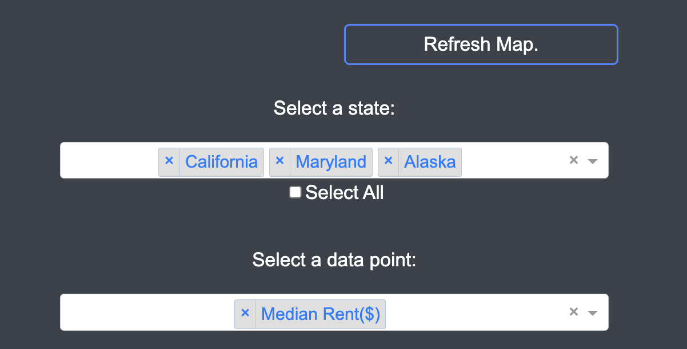

# Rent Prices Across The United States

An interactive visualization system designed to help non-experts learn about the differences in housing and rent pricing across the various counties of the United States.

## Running Locally

First, open the file `Team6Dash.py` in a Python environment. Make sure the environment has the following libraries installed, which are required to run the product:
- `pandas`
- `numpy`
- `plotly`
- `dash`
- `requests`
- `io`
- `geopandas`

Next, clone this repository in your Linux/Unix terminal to download all of its files:
```bash
git clone -b live git@github.com:UMBC-CMSC636-Team6/UMBC-CMSC636-Team6
```
The "live" branch is the current live verson of our repository.<br>
<br>
Once the repository is downloaded, run the Python code. If you are using your terminal, enter this command:
```bash
python3 Team6Dash.py
```
Finally, wait until your terminal or console displays a URL in the following format:
<pre>
...
 * Running on all addresses (0.0.0.0)
 * Running on http://xxx.x.x.x:xxxx
...
</pre>
Copy and paste that link into any browser, and you will be locally redirected to our Dash site.<br>
<br>
Once you're done using it, exit the site by closing its tab on your browser, returning to your terminal/environment, and cancelling the run (e.g. `Ctrl+C` on your keyboard in your terminal).

## Running Online

To access the visualization via internet, simply visit: https://umbc-cmsc636-team6-7pm7.onrender.com<br>
<br>
(Note: Due to some technical difficulties with using the free version of Render, the website may take an unusually long time to load or return a `502 Bad Gateway` error. If you repeatedly experience either issue with this link, refer to the previous section and try opening the site locally.)

## How to Use

Once you have access to the site, you should now be able to scroll down to, access, and hover over a choropleth map of the median rent. By default, it should display only the state of Maryland's data with no settings configured in either dropdown menu, as shown below.
<br>
<br>
To choose what states you want to see visualized, find that state in the "Select a State" dropdown menu and click on it. You may add as many states as you want to the map in this way, or you can choose to display data for the entire country by clicking the "Select All" checkbox under it. To clear your state selections, simply check and then uncheck "Select All".<br>
<br>
To visualize specific value(s) related to housing costs, open the dropdown menu labeled "Select a data point" and choose what you would like to see. Your options are median rent (in dollars), average neigboring rent (in dollars), average rent per room (in dollars), and relative percentages of the latter two values. We recommend selecting either one or two values at a time, and please note that the "Refresh Map" button will *not* work if no values are selected from this dropdown menu.<br>
<br>
When you have finished setting your preferences on what to display, update the map by clicking the "Refresh Map" button found directly above the dropdown menus. This may take between a few frames and several seconds to apply depending on Render's functionality at that moment.
<br>
<br>
Once the choropleth map has been refreshed with your preferences, you can then travel to a specific area on the map as well as view specific data points. Scroll down in the map's region to zoom in, click and drag to move around on the zoomed map, and scroll up to zoom back out. If you want to see the exact data point for a certain county, hover your cursor over that county on the map. This will display the name, state, and value(s) from the dropdown menu for that county.


## Directory Structure

<pre>
Group6_FinalRelease.zip
|---- assets/
|     |---- city.webp
|     |---- style.css
|
|---- screenshots/
|     |---- Screenshot_1.png
|     |---- Screenshot_2.png
|     |---- Screenshot_3.png
|
|---- ACS_5YR_Housing_Estimate_Data_by_County_2352642343660635057.csv
|---- ACS_5YR_Housing_Estimate_Data_by_State_-5633158829445399210.csv
|---- DD_ACS_5-Year_Housing_Estimate_Data_by_County.csv
|---- Team6Dash.py
|
|---- Alpha.ipynb
|---- Phase1_ExtraCredit.ipynb
|---- transformation_artifacts.ipynb
|
|---- county_adjacency2024.txt
|---- geojson-counties-fips.json
|---- us-states.json
|
|---- README.md
|---- contact_info.txt
</pre>

## Known Bugs

For unknown reasons, there is a bug in our repository that causes the state of Connecticut to not appear in the "Select a State" dropdown menu, meaning our data for its counties *cannot* be visualized by any means. We were unable to find a fix for this error due to time constraints.

## Contact Us

If you have any questions, please refer to the file `contact_info.txt`, which contains the name, email address, and GitHub URL of each contributor to this project.
